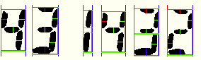
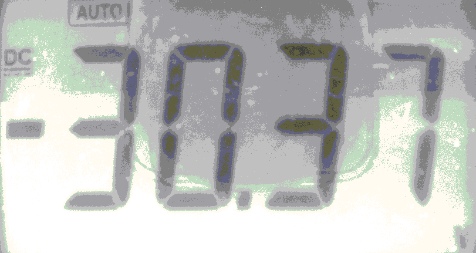
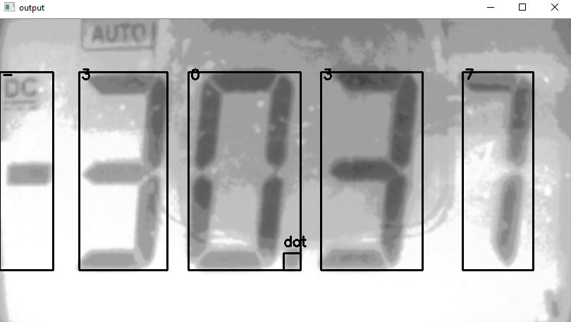
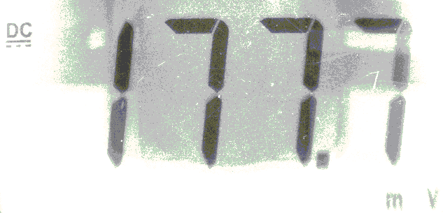
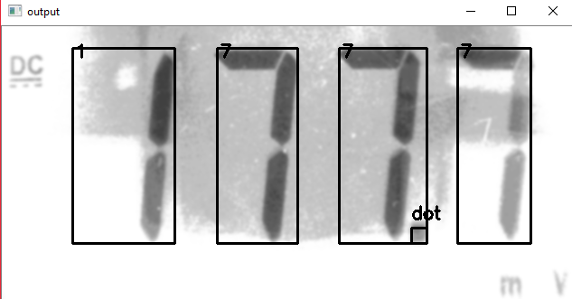
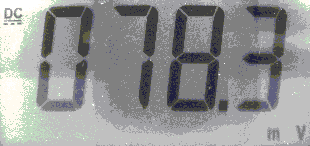
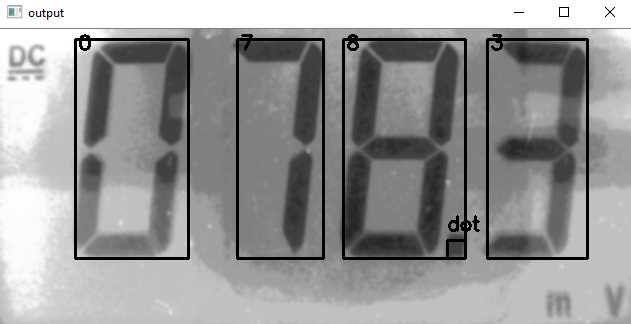
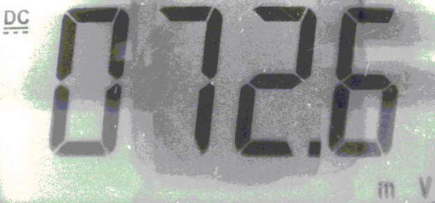
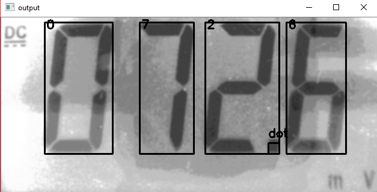

# SSOCR
Seven Segment Optical Character Recognition

## Algorithm


```
DIGITS_LOOKUP = {
    (1, 1, 1, 1, 1, 1, 0): 0,
    (1, 1, 0, 0, 0, 0, 0): 1,
    (1, 0, 1, 1, 0, 1, 1): 2,
    (1, 1, 1, 0, 0, 1, 1): 3,
    (1, 1, 0, 0, 1, 0, 1): 4,
    (0, 1, 1, 0, 1, 1, 1): 5,
    (0, 1, 1, 1, 1, 1, 1): 6,
    (1, 1, 0, 0, 0, 1, 0): 7,
    (1, 1, 1, 1, 1, 1, 1): 8,
    (1, 1, 1, 0, 1, 1, 1): 9,
    (0, 0, 0, 0, 0, 1, 1): '-'
}
```

Digital recognition of seven-segment digital tube is relatively simple compared to handwritten numeral.

Detect the existence of the corresponding bit, then encode the image, you can accurately identify the number.


## Requirements
* opencv
* numpy
* matplotlib

## Setup
```
git clone https://github.com/jiweibo/SSOCR.git
python ssocr.py images/test1.bmp -s
```

## Results









```
$ python ssocr.py images\test1.BMP
['-', 3, 0, '.', 3, 7]
$ python ssocr.py images\test2.BMP -s
[1, 7, 7, '.', 7]
$ python ssocr.py images\test3.BMP -s
[0, 7, 8, '.', 3]
$ python ssocr.py images\test4.BMP -s
[0, 7, 2, '.', 6]
```

## Acknowledge
[SSOCR](https://www.unix-ag.uni-kl.de/~auerswal/ssocr/)